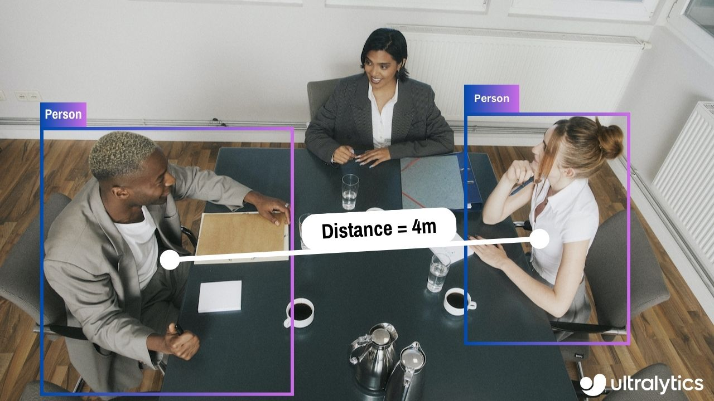

# Distance Calculation using Ultralytics YOLOv8 🚀

## What is Distance Calculation?

Measuring the gap between two objects is known as distance calculation within a specified space. In the case of Ultralytics YOLOv8, the bounding box centroid is employed to calculate the distance for bounding boxes highlighted by the user.

## Distance Calculation using Ultralytics YOLOv8



## Advantages of Distance Calculation?

* Localization Precision: Enhances accurate spatial positioning in computer vision tasks.
* Size Estimation: Allows estimation of physical sizes for better contextual understanding.
* Scene Understanding: Contributes to a 3D understanding of the environment for improved decision-making.

## How to use?

* Click on any two bounding boxes with Left Mouse click for distance calculation

## Note 

* Mouse Right Click will delete all drawn points
* Mouse Left Click can be used to draw points

## Distance Calculation using YOLOv8 Example

```python
from ultralytics import YOLO
from ultralytics.solutions import distance_calculation
import cv2

model = YOLO("yolov8n.pt")
names = model.model.names

cap = cv2.VideoCapture("path/to/video/file.mp4")
assert cap.isOpened(), "Error reading video file"
w, h, fps = (int(cap.get(x)) for x in (cv2.CAP_PROP_FRAME_WIDTH, cv2.CAP_PROP_FRAME_HEIGHT, cv2.CAP_PROP_FPS))

# Video writer
video_writer = cv2.VideoWriter("distance_calculation.avi",
                               cv2.VideoWriter_fourcc(*'mp4v'),
                               fps,
                               (w, h))

# Init distance-calculation obj
dist_obj = distance_calculation.DistanceCalculation()
dist_obj.set_args(names=names, view_img=True)

while cap.isOpened():
    success, im0 = cap.read()
    if not success:
        print("Video frame is empty or video processing has been successfully completed.")
        break

    tracks = model.track(im0, persist=True, show=False)
    im0 = dist_obj.start_process(im0, tracks)
    video_writer.write(im0)

cap.release()
video_writer.release()
cv2.destroyAllWindows()

'''


